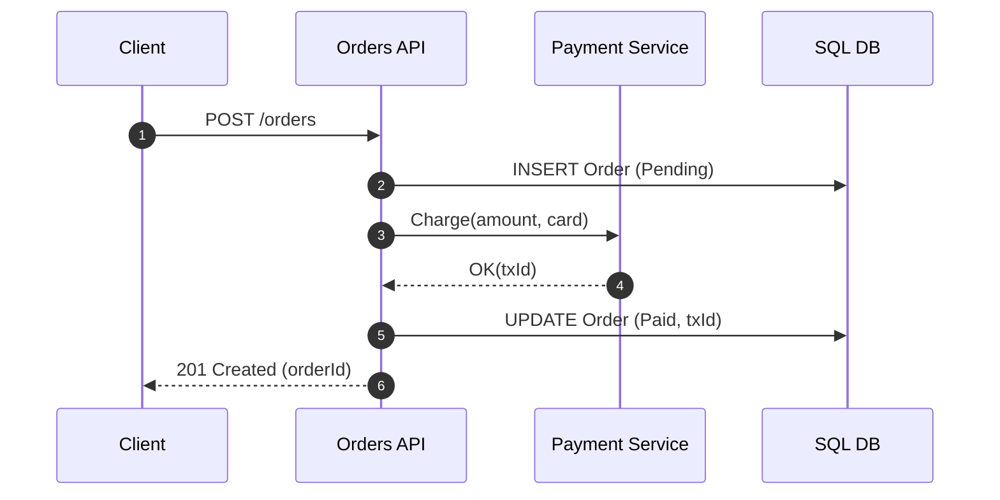

# **Diagrams**

## الترجمة الحرفية  
**Software/Systems Diagrams** — **مخطّطات برمجية/نُظم** لشرح البنية والتدفّقات بصريًا.

## الوصف العربي المختصر  
تمثيل رسومي **مقصود ومُبسّط** لجزء من النظام:  
المكوّنات، العلاقات، تدفّق البيانات/الأحداث، أو حالات الكائنات—للتواصل واتخاذ القرار بسرعة.

## الشرح المبسّط  
- تساعدك على **الفهم المشترك**، واكتشاف الثغرات مبكرًا.  
- يجب أن تكون **محدّدة النطاق**، **متّسقة في الرموز**، و**قابلة للصيانة** مع تغيّر النظام.  
- الأفضل: **Docs-as-Code** (نصّ مثل Mermaid/PlantUML) لسهولة المراجعة والإصدار.

## تشبيه  
خريطة مترو: تُظهر **المحطّات** (مكوّنات)، **الخطوط** (واجهات)، و**الاتجاهات** (تدفّق). ليست كل تفاصيل المدينة—لكن تكفي للرحلة.

---

## الأنواع الشائعة … بسرعة
- **C4**: مستويات Context / Container / Component / Code لشرح المعماريّة تدريجيًا.  
- **Sequence**: تسلسل رسائل بين المشاركين عبر الزمن (Request/Response).  
- **Class/ERD**: بنية الكيانات والعلاقات (ORM/DB).  
- **Flowchart/Activity**: منطق المسار واتخاذ القرار.  
- **State Machine**: حالات وانتقالات كائن/واجهة.  
- **Deployment**: أين تُنشر الأجزاء (Nodes/Pods/VMs).  
- **DFD/BPMN**: تدفّقات بيانات أو عمليات عمل.

---

## مثال Mermaid — مخطّط تسلسلي (Sequence)


## مثال Mermaid — C4 (مستوى Container مبسّط)
```mermaid
flowchart LR
  subgraph Internet
    U[User]
  end
  subgraph Cloud
    W[Web App (.NET)]
    Q[(SQL Database)]
    N[(Cache)]
  end
  U-- HTTP/HTTPS -->W
  W-- SQL -->Q
  W-- get/set -->N
```

---

## مثال كود C# — توليد **Graphviz DOT** تلقائيًا لعلاقات الخدمات
> يُنشئ ملف `system.dot` من قائمة خدمات/اعتمادات. ثم ارسمه:  
> `dot -Tpng system.dot -o system.png`

```csharp
// .NET 8/9
using System;
using System.Collections.Generic;
using System.IO;

class Edge { public string From="", To=""; public Edge(string f, string t){From=f;To=t;}}

class Program
{
    static void Main()
    {
        var services = new[] { "Web", "Orders", "Payments", "Inventory", "SQL", "Redis" };
        var deps = new List<Edge>
        {
            new("Web","Orders"),
            new("Web","Payments"),
            new("Orders","SQL"),
            new("Payments","SQL"),
            new("Web","Redis"),
            new("Orders","Redis")
        };

        using var w = new StreamWriter("system.dot");
        w.WriteLine("digraph G {");
        w.WriteLine("  rankdir=LR; node [shape=box, style=rounded];");
        foreach (var s in services) w.WriteLine($"  \"{s}\";");
        foreach (var e in deps) w.WriteLine($"  \"{e.From}\" -> \"{e.To}\";");
        w.WriteLine("}");
        Console.WriteLine("Wrote system.dot (use Graphviz to render).");
    }
}
```

**الإخراج المتوقع:** صورة تُظهر خدمات `Web/Orders/Payments/...` بأسهم اعتماد واضحة.

---

## خطوات عملية لعمل مخطّط “نافع”
- عرّف **الجمهور والهدف**: قرار معماري؟ تدريب فريق؟ توثيق تشغيل؟  
- اختر **المستوى المناسب** (C4 يفيد للتدرّج).  
- **نطاق واحد لكل مخطّط**؛ لا تحشر كل شيء في صورة واحدة.  
- أضِف **عنوانًا/تعريفًا للرموز** (Legend) ونسخة/تاريخ.  
- التزم **أسماء موحّدة** (Service/DB/Topic) وألوان قليلة.  
- احفظه كنص (Mermaid/PlantUML/DOT) تحت **Git**، وادمجه في الويكي/الـ README.  
- راجعه دوريًا مع تغييرات الكود (ADR/PR checklist: *“هل المخطّط يحتاج تحديثًا؟”*).

---

## أخطاء شائعة
- مخطّط **مزدحم** بلا أولويّة بصريّة.  
- عدم ذكر **افتراضات/حدود النطاق** → سوء فهم.  
- استخدام أيقونات مبهرة دون **معنى ثابت**.  
- صور ثابتة خارج Git → تتقادم بسرعة.  
- خلط مستويات C4 في صورة واحدة → ضبابية.

---

## جدول مقارنة مختصر

| المفهوم            | الغرض الرئيسي                | ملاحظات مهمة                  |
| ------------------ | ---------------------------- | ----------------------------- |
| **Diagrams**       | **تواصل بصري موجّه الهدف**    | **Docs-as-Code** أفضل للصيانة |
| C4 Model           | طبقات سياق→حاويات→مكوّنات→كود | يوضح “منظورًا” واحدًا لكل مخطّط  |
| Sequence Diagram   | رسائل زمنية بين المشاركين    | ممتاز لـ APIs وتدفّقات Sagas   |
| ERD / Class        | نموذج بيانات وعلاقات         | للتصميم المنطقي للـ DB/ORM    |
| Flowchart/Activity | منطق مسار وقرارات            | جيد لسير عمل/قواعد عمل        |
| Deployment         | أين تُنشر المكوّنات            | ربط بـ Infra وبيئات           |

---

## ملخص الفكرة  
**المخطّطات** أداة تفكير وتواصل—اختَر النوع الصحيح، حدّد النطاق، ودوّنها كنص تحت Git.  
اجعلها **بسيطة، متناسقة، وحيّة** مع تغيّر النظام؛ حينها تصبح جزءًا من عملية اتخاذ القرار لا مجرّد رسمة جميلة.
