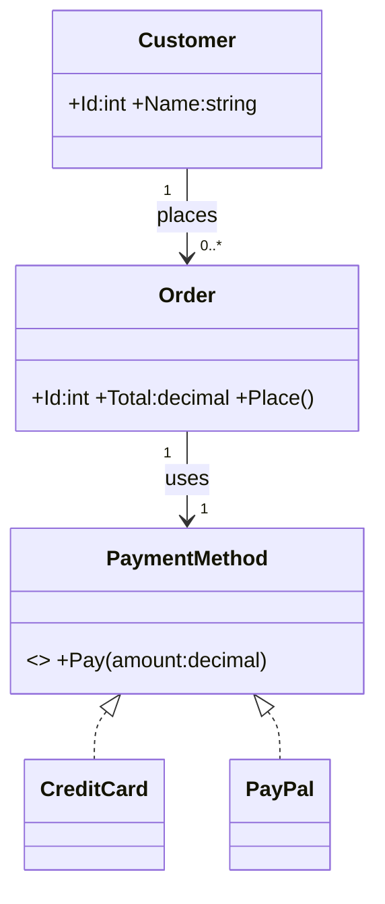
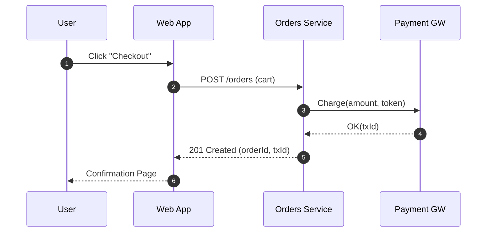

# **UML — Unified Modeling Language**

## الترجمة الحرفية  
**Unified Modeling Language (UML)** — **لغة النمذجة الموحّدة**.

## الوصف العربي المختصر  
ترميز بصري **قياسي** لنمذجة الأنظمة: بنية، سلوك، وتفاعلات.  
ليست منهجية تطوير، بل **لغة رسم** تدعم التحليل والتصميم والتوثيق.

## الشرح المبسّط  
- نوعان أساسيان من المخططات:  
  - **بِنيويّة (Structural):** Class, Object, Component, Deployment, Package.  
  - **سلوكيّة (Behavioral):** Use Case, Sequence, Activity, State Machine, Communication, Timing.  
- تفيد في: توحيد الفهم، تقليل الغموض، تخطيط الحدود والواجهات، وإسناد القرارات (ADR).  
- تُكتب يدويًا أو كنص (Mermaid/PlantUML) ضمن **Docs-as-Code** تحت Git.

## تشبيه  
أبجدية ورموز موحّدة ليرسم بها الفريق **خرائط النظام** بدل الكلام العامّي المختلف بين الأفراد.

---

## مثال 1 — **Class Diagram** (Mermaid) + كود C# مطابق

### مخطط (Mermaid)


### كود C# مكافئ (تكوين/توريث/اعتماد)
```csharp
public record Customer(int Id, string Name)
{
    public List<Order> Orders { get; } = new();
}

public interface IPaymentMethod
{
    void Pay(decimal amount);
}

public class CreditCard : IPaymentMethod
{
    public string MaskedNumber { get; init; } = "**** **** **** 1234";
    public void Pay(decimal amount) { /* اتصال بوابة بطاقات */ }
}

public class PayPal : IPaymentMethod
{
    public string AccountEmail { get; init; } = "buyer@example.com";
    public void Pay(decimal amount) { /* API باي بال */ }
}

public class Order
{
    public int Id { get; init; }
    public decimal Total { get; private set; }
    private readonly IPaymentMethod _payment;

    public Order(IPaymentMethod payment) => _payment = payment;

    public void AddLine(decimal price) => Total += price;

    public void Place()
    {
        // يعتمد على طريقة الدفع (تعدد الأشكال)
        _payment.Pay(Total);
        // تحديث حالة/إطلاق حدث...
    }
}
```

**الفكرة:** المخطط يوضّح **توريث الواجهة** و**العلاقات** (عميل يملك طلبات، الطلب يستخدم وسيلة دفع).

---

## مثال 2 — **Sequence Diagram** (تسلسل رسائل)

**الفكرة:** من “النقر” حتى التأكيد، تُعرض الرسائل حسب الزمن بين المشاركين.

---

## خطوات عملية لاستخدام UML بفعالية
- حدِّد **الغرض والجمهور** (قرار معماري؟ توثيق واجهات؟ تدريب فريق؟).  
- اختر **نوع المخطط** المناسب للنطاق (Class/Sequence/Activity/…)، واحد لكل سؤال.  
- ابقِ الرموز **موحّدة وبسيطة** وأضِف تعليقات قصيرة/Legend عند الحاجة.  
- استخدم **نصًا قابلًا للمراجعة** (Mermaid/PlantUML) داخل المستودع.  
- اربط المخططات بـ **ADR** وطلبات الدمج. راجعها عند تغيّر التصميم.  
- لا تُفرط بالتفاصيل: مستوى **Component/Container** غالبًا يكفي للاجتماعات.

---

## أخطاء شائعة
- خلط مستويات متعددة في صورة واحدة (سياق + كود تفصيلي).  
- تفاصيل مفرطة تجعل الرسم غير قابل للصيانة.  
- استخدام أشكال غير قياسية تربك القارئ.  
- مخططات لا تُحدَّث بعد تغييرات الكود.  
- اختيار نوع مخطط غير مناسب للسؤال (استخدام Class بدل Sequence لتدفّق رسائل).


---

## ملخص الفكرة  
**UML** يمنحك **لغة رسومية موحّدة** لتوثيق التصميم والتفاعلات.  
اختر **المخطط الصحيح**، احفظه كنص تحت Git، وابقِه بسيطًا ومحدّثًا—تحصل على فهم مشترك وقرارات أدق بسرعة.
